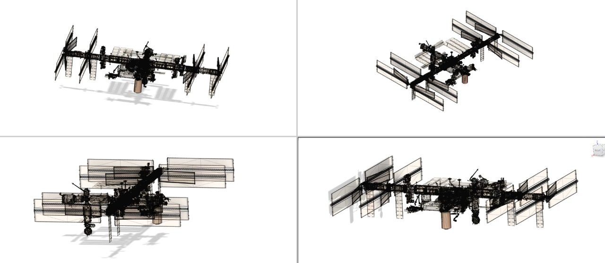
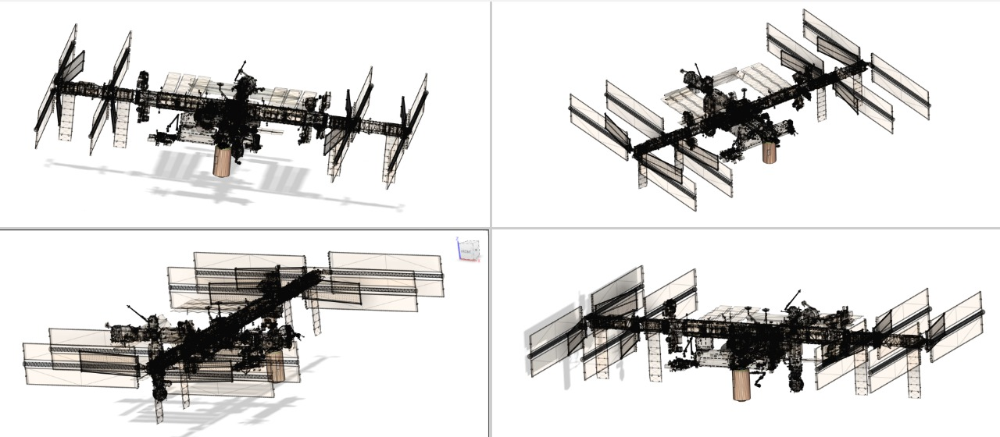

<!-- Space reserved for images -->

### 3D Modeling In Fusion 360— Chorimars Module

**3D modeling** focuses on representing the **Chorimars module**, designed as an orbital manufacturing prototype, and its integration with the **ISS** in a realistic, technical manner. The module uses the **Common Berthing Mechanism (CBM)** as its docking system, incorporating an **active CBM** for mating to **Harmony (Node 2), nadir port**, and a **passive CBM** on the opposite end, enabling future modular extensions.

